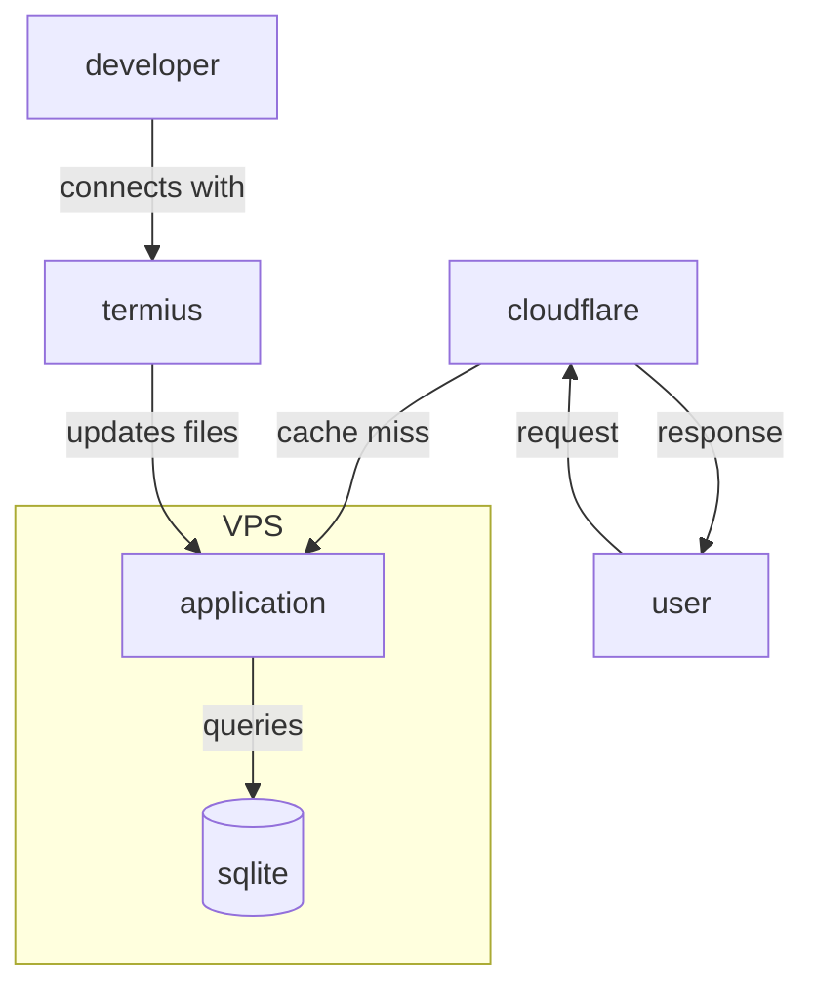
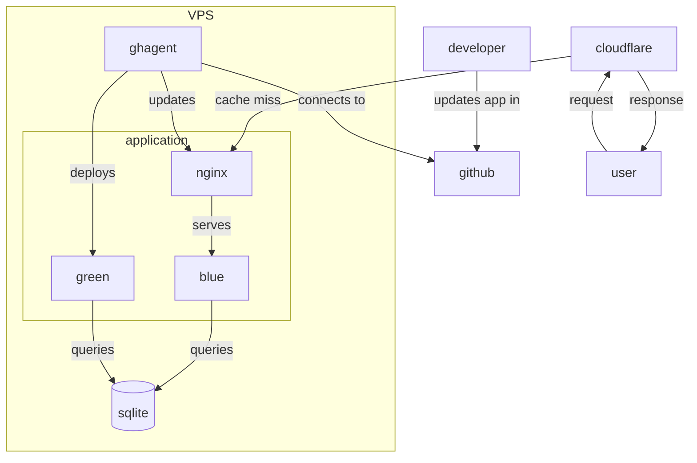

# Blue Green VPS

## Glossary

- VPS: I will be using VPS in this Readme to avoid saying VM or VPS every time.

## Context

Feasibility study for deploying golang apps to private VPS and serve them using Cloudflare. Based on levelsio style but with some checks in place + adapted for compiled languages.

## Deployment Approaches Comparison

### levelsio Style (Traditional)

The [levelsio approach](https://levels.io/) is a minimalist deployment strategy popular among indie hackers:

- **Direct file editing**: Developers SSH into the VPS and edit files directly on the server
- **Interpreted languages**: Works well with PHP, Node.js, Python where file changes take effect immediately without restart
- **Simple setup**: Minimal infrastructure - just the app, database, and reverse proxy (Cloudflare)
- **Manual process**: Updates require manual SSH connection and file modification



**Pros**: Simple, fast iteration, minimal infrastructure  
**Cons**: Manual deployment process, potential for human error, downtime risk with compiled languages

### This Project (Blue-Green with CI/CD)

This project adapts the levelsio philosophy for **compiled languages** (like Go) while maintaining simplicity and adding reliability:



### Key Improvements

| Aspect                   | levelsio Style                            | This Project                        |
| ------------------------ | ----------------------------------------- | ----------------------------------- |
| **Connection Direction** | Incoming SSH (developer → VPS)            | Outgoing polling (VPS → GitHub)     |
| **Language Support**     | Interpreted languages (no restart needed) | Compiled languages (Go, Rust, etc.) |
| **Deployment Process**   | Edit files directly via SSH               | Build → Deploy → Switch             |
| **Downtime**             | Minimal for interpreted languages         | Zero-downtime blue-green deployment |
| **Deployment Method**    | Manual SSH-based updates                  | Automated GitHub-based deployment   |
| **Process Automation**   | Manual process                            | Automated CI pipeline               |
| **Security**             | Requires SSH access                       | No incoming connections needed      |

### Why These Changes?

1. **Outgoing Connections**: Instead of requiring SSH access, the VPS polls GitHub for updates. More secure and firewall-friendly.

2. **Compiled Language Support**: Go/Rust apps need compilation, binary replacement, and service restart - can't just edit files in place like PHP.

3. **Zero Downtime**: Blue-green deployment with nginx switching between two app instances ensures users never see downtime during updates.

4. **Automated Pipeline**: GitHub Actions can run tests, security scans, and build artifacts before deployment.

5. **Reduced Human Error**: Automated processes reduce the risk of manual deployment mistakes.

The result is a deployment strategy that keeps the simplicity spirit of levelsio while being production-ready

## Setup

### VPS

#### Local env

Create a VM in your local machine. I used `multipass`.
you can install `multipass` with brew in MacOs.

```shell
 multipass launch 24.04 --name bluegreen --cpus 2 --memory 4G --disk 30G
```

This will create a VM with ubuntu called bluegreen.

#### External VPS

For production/staging you can create a VPS where you need (AWS EC2, Hetzner, etc). Once you have it we can continue with the same process.

### Runner Installation

We will set up a GH Runner within the VPS so we can use it to run commands within.

- Open a shell to the VPS
  In case of using multipass: multipass shell bluegreen
- Go to https://github.com/<user>/<repo>/settings/actions/runners
  For example: https://github.com/saasuke-labs/bluegreen-vps/settings/actions/runners
- Click on `New Self-Hosted Runner`
- Choose the image of the runner and architecture of the runner.
  For example running multipass in a M-series Mac would be: Linux - ARM64
- Run the scripts shown on-screen within the VPS shell.
  During the process you will need to set some variables:
  - Group name: empty
  - Runner name: set something you can easily identify.
    For example I will use `bluegreen-localvm` for my local vm because I plan to create another VPS with its runner in the cloud.
  - Labels: enter some labels in a similar fashion. We will use them to select the jobs we want to run in the VPS.
    I am setting `bluegreen-localvm`
  - Work folder: I am leaving it as the default `_work`.

If you go to the runners list again you should find your runner. Online and idle.
If we restart the VPS the runner will go offline. We will set it as a service later.

## Testing the runner

We are going to use a simple github workflow to check that the runner is up and able to accept jobs.
You can find an example [here](.github/workflows/ping-runner.yaml).

In order to run it manually we need to go to:

https://github.com/<user>/<repo>/actions/workflows/ping-runner.yaml

And go to the select that says `Run Workflow` expand and click on the green button that says `Run Workflow`.
If the runner was online, the job should work without problems.

> [!WARNING]
> If you are working on a branch you will not see the workflow in the list of workflows.
> All workflows need to be merged to main once so they are picked by github and listed.
