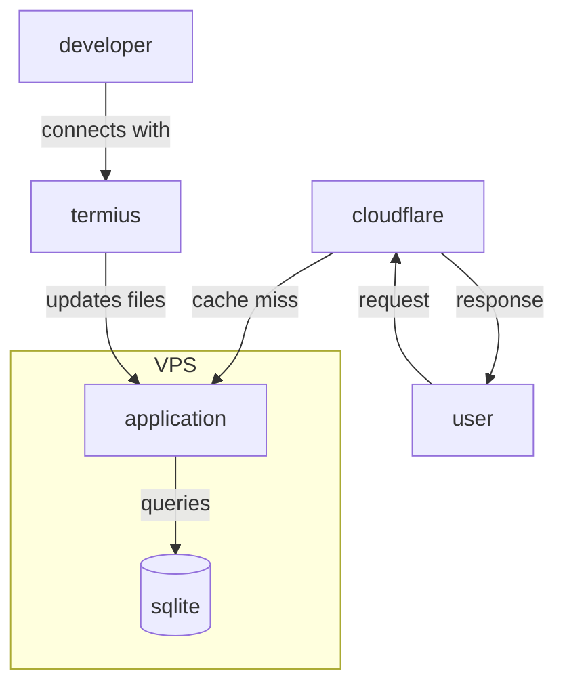
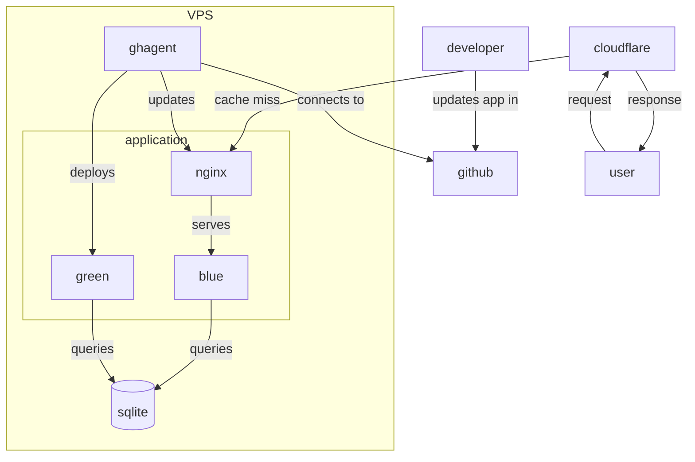

# Blue Green VPS

Feasibility study for deploying golang apps to private VPS and serve them using Cloudflare. Based on levelsio style but with some checks in place + adapted for compiled languages.

## Deployment Approaches Comparison

### levelsio Style (Traditional)

The [levelsio approach](https://levels.io/) is a minimalist deployment strategy popular among indie hackers:

- **Direct file editing**: Developers SSH into the VPS and edit files directly on the server
- **Interpreted languages**: Works well with PHP, Node.js, Python where file changes take effect immediately without restart
- **Simple setup**: Minimal infrastructure - just the app, database, and reverse proxy (Cloudflare)
- **Manual process**: Updates require manual SSH connection and file modification

**Pros**: Simple, fast iteration, minimal infrastructure  
**Cons**: Manual deployment process, potential for human error, downtime risk with compiled languages

### This Project (Blue-Green with CI/CD)

This project adapts the levelsio philosophy for **compiled languages** (like Go) while maintaining simplicity and adding reliability:

### Key Improvements

| Aspect                   | levelsio Style                            | This Project                        |
| ------------------------ | ----------------------------------------- | ----------------------------------- |
| **Connection Direction** | Incoming SSH (developer → VPS)            | Outgoing polling (VPS → GitHub)     |
| **Language Support**     | Interpreted languages (no restart needed) | Compiled languages (Go, Rust, etc.) |
| **Deployment Process**   | Edit files directly via SSH               | Build → Deploy → Switch             |
| **Downtime**             | Minimal for interpreted languages         | Zero-downtime blue-green deployment |
| **Deployment Method**    | Manual SSH-based updates                  | Automated GitHub-based deployment   |
| **Process Automation**   | Manual process                            | Automated CI pipeline               |
| **Security**             | Requires SSH access                       | No incoming connections needed      |

### Why These Changes?

1. **Outgoing Connections**: Instead of requiring SSH access, the VPS polls GitHub for updates. More secure and firewall-friendly.

2. **Compiled Language Support**: Go/Rust apps need compilation, binary replacement, and service restart - can't just edit files in place like PHP.

3. **Zero Downtime**: Blue-green deployment with nginx switching between two app instances ensures users never see downtime during updates.

4. **Automated Pipeline**: GitHub Actions can run tests, security scans, and build artifacts before deployment.

5. **Reduced Human Error**: Automated processes reduce the risk of manual deployment mistakes.

The result is a deployment strategy that keeps the simplicity spirit of levelsio while being production-ready
